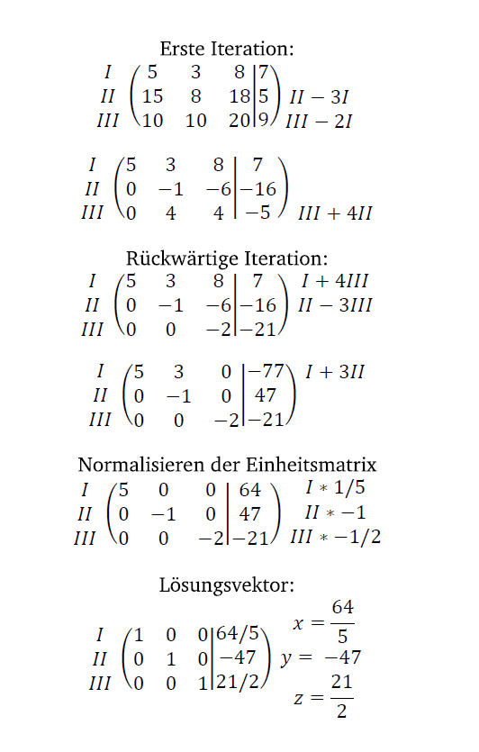
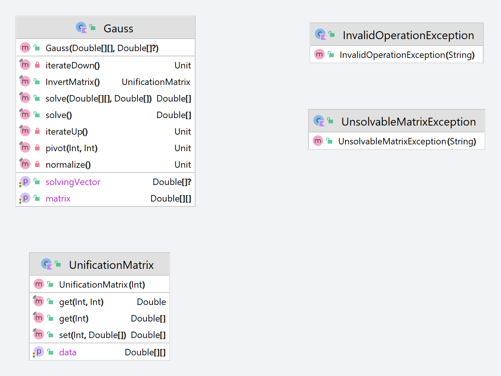
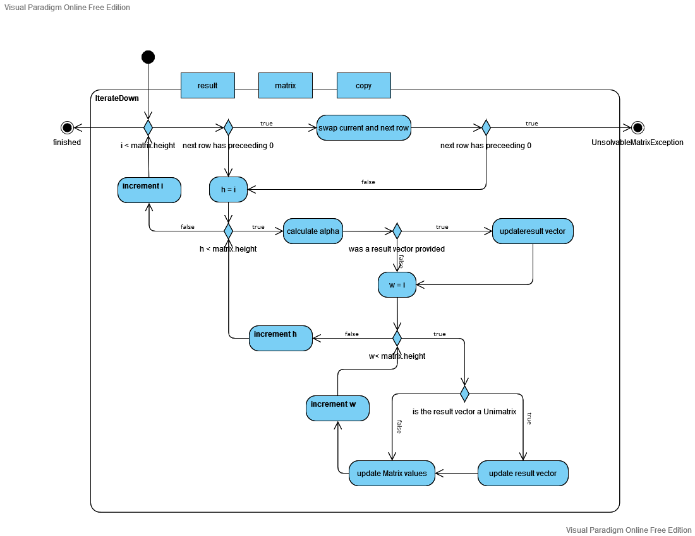
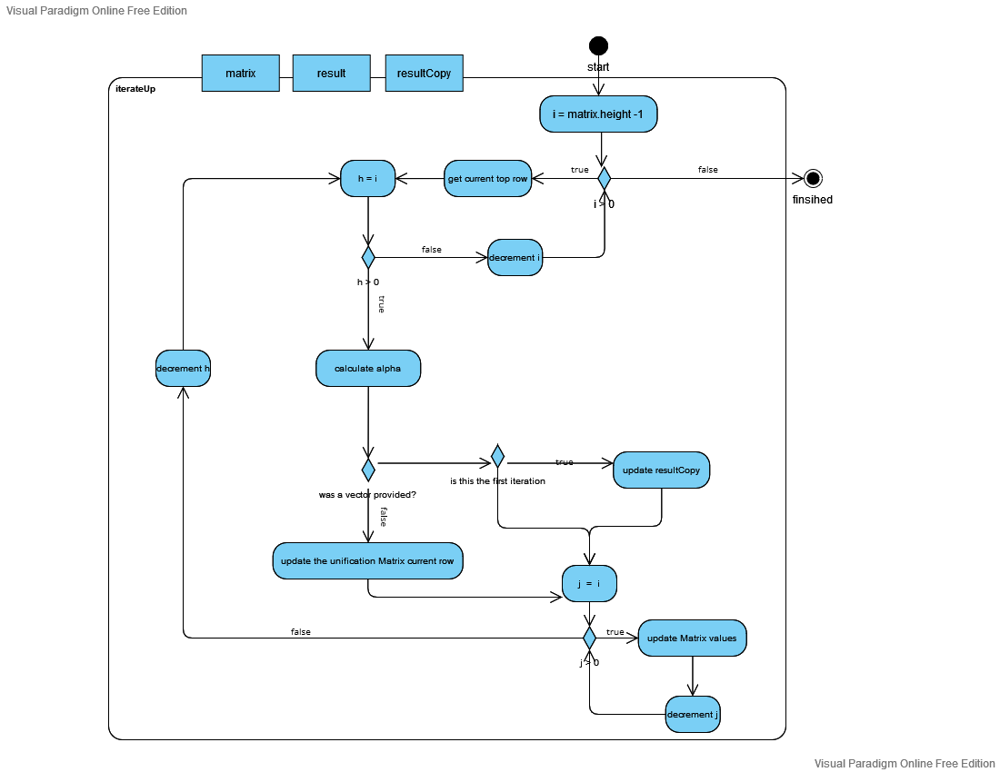
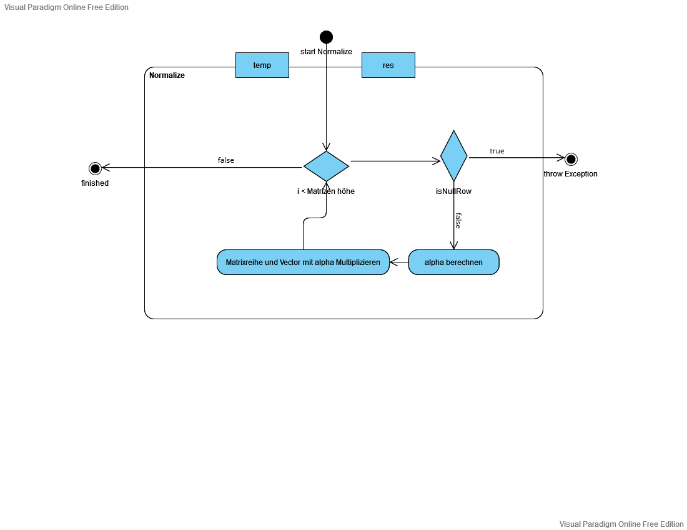

= Linear Mathematics Library
Jacek Langer <jacek.langer@tu-darmstadt.de>
3.0, July 29, 2022: AsciiDoc article template
:toc:
:icons: font
:url-quickref: https://docs.asciidoctor.org/asciidoc/latest/syntax-quick-reference/
:hide-uri-scheme:

by Jacek Langer

== Hintergrund

Bei LGS handelt es sich um ein Schulprojekt, zum Lösen von Matrizen.
Dabei findet der Gauß-Algorithmus Verwendung.
Bei der Implementierung handelt es sich um eine Klassenbibliothek die eine Statische Methode bereitstellt.
Es wird ein Argument erwartet und ein weiteres ist Optional zu Übergeben.
Wird nur ein Argument übergeben wird aus der Übergebenen Matrix die Inverse Matrix gebildet.
Wird ein Vector als zweites Argument übergeben wird die Angegebene Matrix anhand des Lösungsvektors gelöst.

== Gauß Algorithmus zum Lösen von Matrizen

Beim Gaußschen Algorithmus zum lösen von Matrizen handelt es sich um ein Iteratives Verfahren zum Lösen von Matrizen anhand eines Lösungsvektors.
Dabei wird eine Matrix mit einem Aus-gangsvektor gleichgestellt und die einzelnen Zeilen der Matrix mit einander addiert bis die Matrix eine Einheitsmatrix darstellt.
Dabei wird auf den Vektor dieselbe Operation angewendet wie auf die Matrix.
Bei einer gelösten Matrix können die Werte für die einzelnen Unbekannten aus dem Lö-sungsvektor abgelesen werden.

[#Gaus-Algo]

== Anwendung

Diese <<Klassendiagramm,Klassenbibliothek>> stellt eine Klasse bereit.
Bei der initialisierung der Klasse wird eine Mehrdimensionales Array von Double Werten erwartet.
Die angabe eines Lösungsvektors ist optional.

Wird kein Lösungsvektor angegeben kann die Matrix nicht gelöst werden, es steht lediglich die Methode bereit die Inverse der Matrix zu bilden.
Die Matrix und der Lösungsvektor können nachträglich geändert werden.

.Methoden:
* solve
* Invert

=== solve

Löst die Matrix mit Hilfe des angegebenen Vektors.
Das Ergebnis dieser Operation ist ein Vektor.

.Matrix Lösen, vollständige Instanzierung
====
var matrix = arrayOf(doubleArrayOf(2.0, 4.0), doubleArrayOf(2.0, 3.0))

var vector = doubleArrayOf(5.0, 6.0)

var result = Gauss(matrix,vector).solve()
====

=== solve mit Parametern

Diese Funktion erwartet zwei Parameter.
Eine Matrix und einen Vektor.
Die Matrix und der Lösungsvektor werden neu gesetzt.
Anschließend die Matrix gelöst.

.Matrix Lösen
====

var matrix = arrayOf(doubleArrayOf(2.0, 4.0), doubleArrayOf(2.0, 3.0))

var gauss = Gauss(matrix) var vector = doubleArrayOf(5.0, 6.0)

var result = gauss().solve(matrix,vector)

====

=== Invert

Generiert die Inverse der Matrix.

.Inverse einer Matrix generieren
====

var matrix = arrayOf(doubleArrayOf(2.0, 4.0), doubleArrayOf(2.0, 3.0))

var vector = doubleArrayOf(5.0, 6.0)

var inverse = Gauss(matrix,vector).invert()

====

Der ganaue Ablauf lässt sich <<IterateDown,hier>> finden.

=== Ausnahmen

Wird eine Matrix ohne Angabe eines Lösungsvektors gelöst wird eine `InvalidOperationException` geworfen.
Stellt sich beim Lösen einer Matrix fest das es sich um eine unlösbare Matrix handelt wird eine `UnsolvableMatrixException` geworfen.
Wird eine Matrix angegeben dessen Rang ungleich dem Rang des Lösungsvektors ist wird ebenfalls eine `UnsolvableMatrixException` geworfen.

Weitere Informationen finden sich link:../build/dokka/html/index.html[hier]

=== UML-Diagramme

[#Klassendiagramm]

[#IterateDown]

[#IterateUp]

[#Normalize]

==== Abhängigkeiten und Systemanforderungen

|===
| Dependency |Version

|JVM|16
|Kotlin| 1.6.2
|Java| 17
|Gradle| 7.4.2
|JUnit | 5.6.0
|GSON.footnote:[Testing only] | 2.9.0

|===

